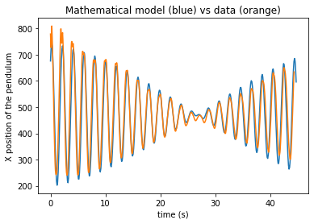

# README: Understanding the Dynamics of Connected Pendulums

## Purpose
This README provides an overview of the experimentation and analysis of two connected pendulums compared to a single pendulum. The goal is to explore how the behavior of two pendulums changes when connected and observe the energy transfer between them.

## Experiment Setup
- Two pendulums are used, each with a string length of 1m.
- The pendulums are separated by 15cm, with a connecting string positioned 5cm from the top of each pendulum.
- Initial observations are made by manually pulling one pendulum and observing the behavior of both pendulums.

## Observations
1. **Initial Interaction:** When one pendulum is manually pulled, the second pendulum starts swinging in response but lags behind initially.
2. **Energy Transfer:** Over time, the second pendulum also starts swinging and the energy is transferred between the pendulums. The second pendulum may also swing out of phase with the first pendulum several times.

## Variations Explored
1. **Different Connecting String Height:** When the connecting string height is lowered to 22cm, the energy transfer between the pendulums becomes more pronounced. The second pendulum eventually comes to a stop while the first pendulum continues swinging.
2. **Varying Initial Release Angle:** A larger initial release angle leads to a longer duration before the second pendulum comes to a rest. This is likely due to increased gravitational potential energy in the second pendulum caused by its slightly higher position.

## Hypotheses and Ideas
1. **Angle and Second Pendulum's Rest Period:** Investigate whether the time period between the second pendulum's rest phase depends on the angle of its initial release.
2. **Effect of Connecting String Height:** Explore the relationship between the time period and the height of the connecting string.
3. **Impact on First Pendulum:** Determine if changing any aspect of the experiment results in the first pendulum also coming to a rest.

## Future Experimentation
1. **Hypothesis:** The initial angle of release may not affect the time needed for the second pendulum to stop for the second time.
2. **Procedure:** Set up the pendulums with the connecting string at a fixed height. Measure and vary the angle of initial release (10, 20 degrees). Record the time it takes for the second pendulum to stop swinging.
3. **Data Collection:** Collect data for multiple trials at each angle and analyze to confirm or refute the hypothesis.

## Video Analysis and Mathematical Modeling
- Motion tracking of the pendulum's movement was conducted using a phone camera and video analysis code.
- The code segments frames, applies thresholding, and calculates the centroid of the pendulum's motion.
- A mathematical model using the sine function was developed to fit the motion data.
- Initial parameters for the model were adjusted through trial and error to match the observed data.

## Analysis of Mathematical Model
- The mathematical model provided a good fit to the observed motion data.
- Further experimentation is recommended to explore potential factors like amplitude decay over time.

## Conclusion
This README provides an overview of the purpose, experiment setup, observations, variations explored, hypotheses, future experimentation, and analysis conducted with connected pendulums. The study sheds light on the intricate dynamics and energy transfer between connected pendulums and offers insights for further research.
